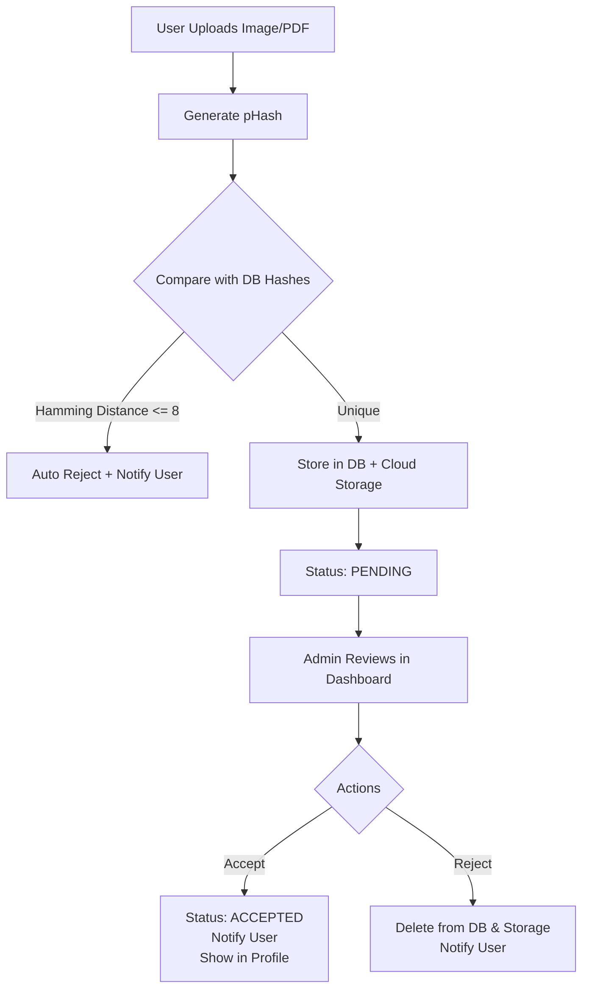

# NewsConnect – Mediator App

> **A secure, real-time news upload mediation platform** where users submit images and PDFs, admins review via a dashboard, and duplicate images are auto-rejected using **perceptual hashing**. Accepted submissions appear in user profiles with notifications; rejected ones are **permanently deleted**.

---

## Overview

**NewsConnect** is a full-stack web application that enables **user-generated content submission** with **strict moderation** and **anti-duplication safeguards**.

### Key Features
- **User Uploads**: Submit **JPEG/PNG images** and **PDFs**
- **Duplicate Detection**: Uses **perceptual hash (pHash)** to detect near-identical images
- **Admin Dashboard**: View pending uploads with **live previews**
- **Accept/Reject Workflow**: One-click admin decisions
- **Auto-Cleanup**: Rejected files are **deleted from DB & cloud storage**
- **Real-Time Notifications**: Status updates appear in **user profile**

---

## Flowchart: Upload & Review Process

Core Functionalities
1. User Upload Module

Upload image + PDF (optional)
Generate perceptual hash on upload
Compare with all existing image hashes
Auto-reject if similarity > 90% (Hamming ≤ 8)
Store only unique submissions

2. Admin Review Module

View pending queue with thumbnails
Preview PDF in-browser
Accept → Save + Notify
Reject → Delete from DB & cloud
